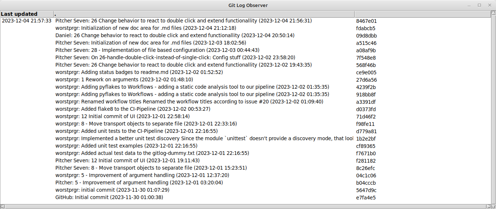
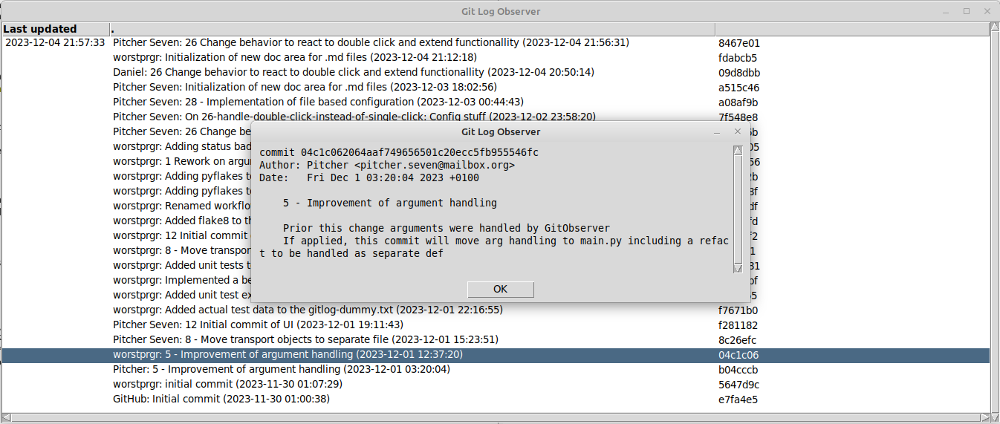

# Graphical User Interface "Viewer"
</img>  
The more folders are in observation, the less structured can results be presented in command line.  
This experience was gained fast at our tests, we just took two folders and got annoyed to need scrolling back and forward all the time.  

## Motivation
If we had all information structured in a grid, we could have a great overview what was found in which iteration.
So, the list of observed folders can be _n_ and still would be readable. Having scroll bars would provide the capability to focus on single folders but having other folder information on hand as well in the area out of view.

## Usage
The _Viewer_ can be called either by passing [argument](../README.md) _-ui/--use-viewer_ or by configuring so in configuration file.  Please note that it will force use of argument "_descending_" in order to have descending sorted blocks per result time stamp as seen in our example:  

  

_Main view on Linux Mint_  

The first column is used to visualize time stamp of observation. Technically, this is the time when the result is print to UI.  
Each folder has a column for message information "[Author][Title][Author date]" and a column representing the SHA1 of corresponding commit.  

### Origin
By [argument](../README.md), you can pass an origin which then is used to build a web link with pattern [origin]/[SHA1].  
This link will be opened in system default web browser by double-clicking a SHA1 value  
This brings the opportunity to check for Pull Requests or further information inside your local Git management system.  

### Commit message
By double-clicking one specific message, a new window pop-ups holding the equivalent of  
`git log --pretty='medium'`  

  

_Detail view on Linux Mint_  

## Supported platforms
The UI is based on Python TKinter, meaning that the _Viewer_ can be run anywhere, where a commonly used desktop with Python capability runs.  
Our journey started using **Windows** and continued on **Linux** Mint as well.  
We quite didn't try, if macOS is supported running _Viewer_ yet.  

## Known Issues  
### Multi-Mon  
Currently, we know that the details spawn in primary screen. We actually don't see a problem there but this might change in the future  

### Commit message line breaks
The commit message is presented like we receive it from command line.  
This of course means that text might get strange line breaks. We plan to implement an enhancement on this.

### Sorting might irritate when used first  
Our approach is, that the most important information always has to be top message.  
By this, each blocks content is sorted descending but blocks are sorted ascending. This can be confusing and might change in future releases.  